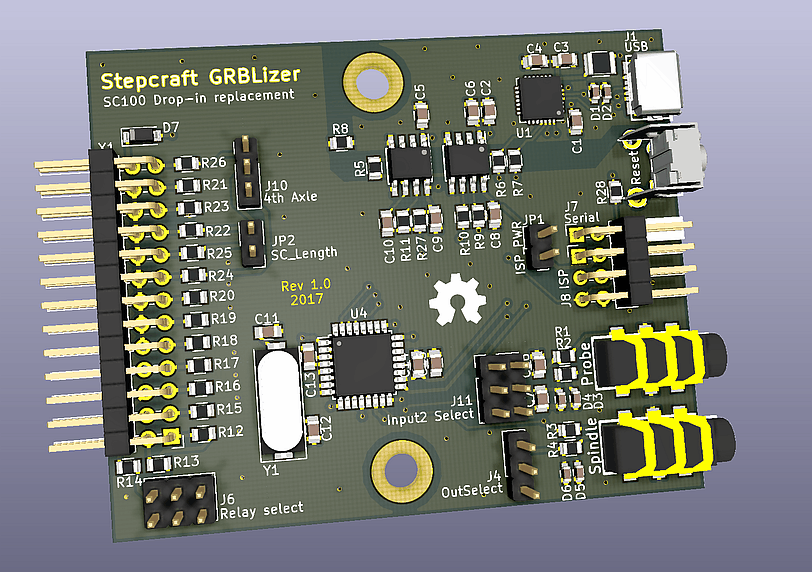

# Stepcraft GRBLizer

A GRBL compatible controller for use as a drop-in replacement for the SC100 USB standard controller deliverd with Stepcraft CNC machines. This Arduino Uno compatible controller is wired conforming the GRL v0.9+ standard. The controller can be used with the GRBL firmware and with EstlCAM. 

## Features
  - The PC is fully electrically isolated from the CNC machine (optional).
  - All inputs protected with clamping diodes and resistors.
  - Probe inputs have a 100 Ohm / 100nF low pass filter to suppress spurious triggering. (Filter values may be experimented with.)
  - 3.5mm Jack for spindle / laser / hot-end control
  - 3.5mm Jack input for 2 probes.
  - Serial interface fed out the back (TTL, not protected). For people in a hurry: CP2102 and isolator ICs can be left unpopulated.
  - Standard 6 pin ISP programming connector fed out the back  (not protected).
  - Some juper block for IO-config

Alvast een leuk plaatje:



# Stepcraft 420 CNC settings with GRBLizer

Notes kindly provided by [Albin Stigö](https://github.com/ast) on getting [GRBL v1.1](https://github.com/gnea/grbl/wiki) working with the
[GRBLizer](https://github.com/eflukx/Stepcraft-GRBLizer) board.

Tested on Stepcraft 420, but probably works with most other Stepcraft types.

## Setup

* Stepcraft 420 CNC
* Stepcraft drivers with GRBLizer board
* [GRBL v1.1](https://github.com/gnea/grbl/wiki)
* [Universal-G-Code-Sender](https://github.com/winder/Universal-G-Code-Sender)

Install GRBL in the usual way. However you need to make some changes in config.h and cpu_map.h.

```c
/* cpu_map.h */

// The Stepcraft has all limits on one pin.
#define X_LIMIT_BIT    1  // Uno Digital Pin 9
#define Y_LIMIT_BIT    1  // Uno Digital Pin 9
#define Z_LIMIT_BIT    1  // Uno Digital Pin 9
```

```c
/* config.h */

// Since all limit switches end up being shared on one pin, 
// we can only home one direction at a time.
#define HOMING_CYCLE_0 (1<<Z_AXIS)  // REQUIRED: First move Z to clear workspace.
#define HOMING_CYCLE_1 (1<<Y_AXIS)  // OPTIONAL: Then move X,Y at the same time.
#define HOMING_CYCLE_2 (1<<X_AXIS)  // OPTIONAL: Uncomment and add axes mask to enable

// The stop output of the Stepcraft board is inverted to what GRBL expects.
// However you simply can't swap the switch because the driver board will also
// disable the motors so nothing will move.
#define INVERT_CONTROL_PIN_MASK (1<<CONTROL_RESET_BIT) // Default disabled.
```

## GRBL settings

I haven't done a lot of fine tuning but these seems to work well enough.

```
$0 = 50				(Step pulse time, microseconds)
$1 = 100			(Step idle delay, milliseconds)
$2 = 0				(Step pulse invert, mask)
$3 = 0				(Step direction invert, mask)
$4 = 1				(Invert step enable pin, boolean)
$5 = 1				(Invert limit pins, boolean)
$6 = 0				(Invert probe pin, boolean)
$10 = 1				(Status report options, mask)
$11 = 0.010			(Junction deviation, millimeters)
$12 = 0.002			(Arc tolerance, millimeters)
$13 = 0				(Report in inches, boolean)
$20 = 0				(Soft limits enable, boolean)
$21 = 0				(Hard limits enable, boolean)
$22 = 1				(Homing cycle enable, boolean)
$23 = 1				(Homing direction invert, mask)
$24 = 120.000		(Homing locate feed rate, mm/min)
$25 = 900.000		(Homing search seek rate, mm/min)
$26 = 250			(Homing switch debounce delay, milliseconds)
$27 = 1.000			(Homing switch pull-off distance, millimeters)
$30 = 1000			(Maximum spindle speed, RPM)
$31 = 0				(Minimum spindle speed, RPM)
$32 = 0				(Laser-mode enable, boolean)
$100 = 133.333		(X-axis travel resolution, step/mm)
$101 = 133.333		(Y-axis travel resolution, step/mm)
$102 = 133.333		(Z-axis travel resolution, step/mm)
$110 = 800.000		(X-axis maximum rate, mm/min)
$111 = 800.000		(Y-axis maximum rate, mm/min)
$112 = 800.000		(Z-axis maximum rate, mm/min)
$120 = 10.000		(X-axis acceleration, mm/sec^2)
$121 = 10.000		(Y-axis acceleration, mm/sec^2)
$122 = 10.000		(Z-axis acceleration, mm/sec^2)
$130 = 300.000		(X-axis maximum travel, millimeters)
$131 = 420.000		(Y-axis maximum travel, millimeters)
$132 = 140.000		(Z-axis maximum travel, millimeters)
```